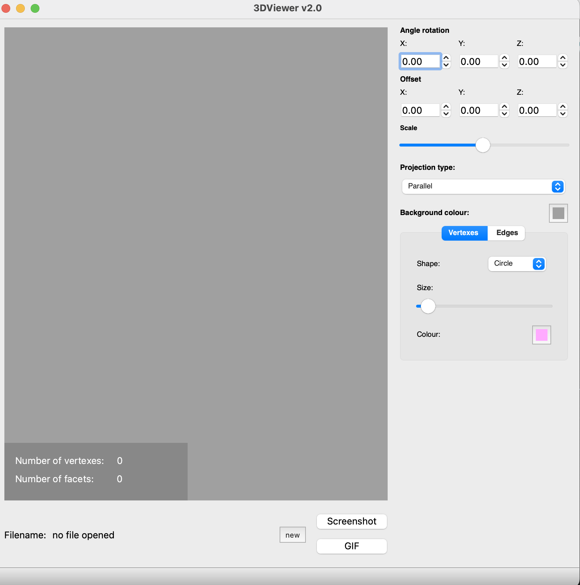
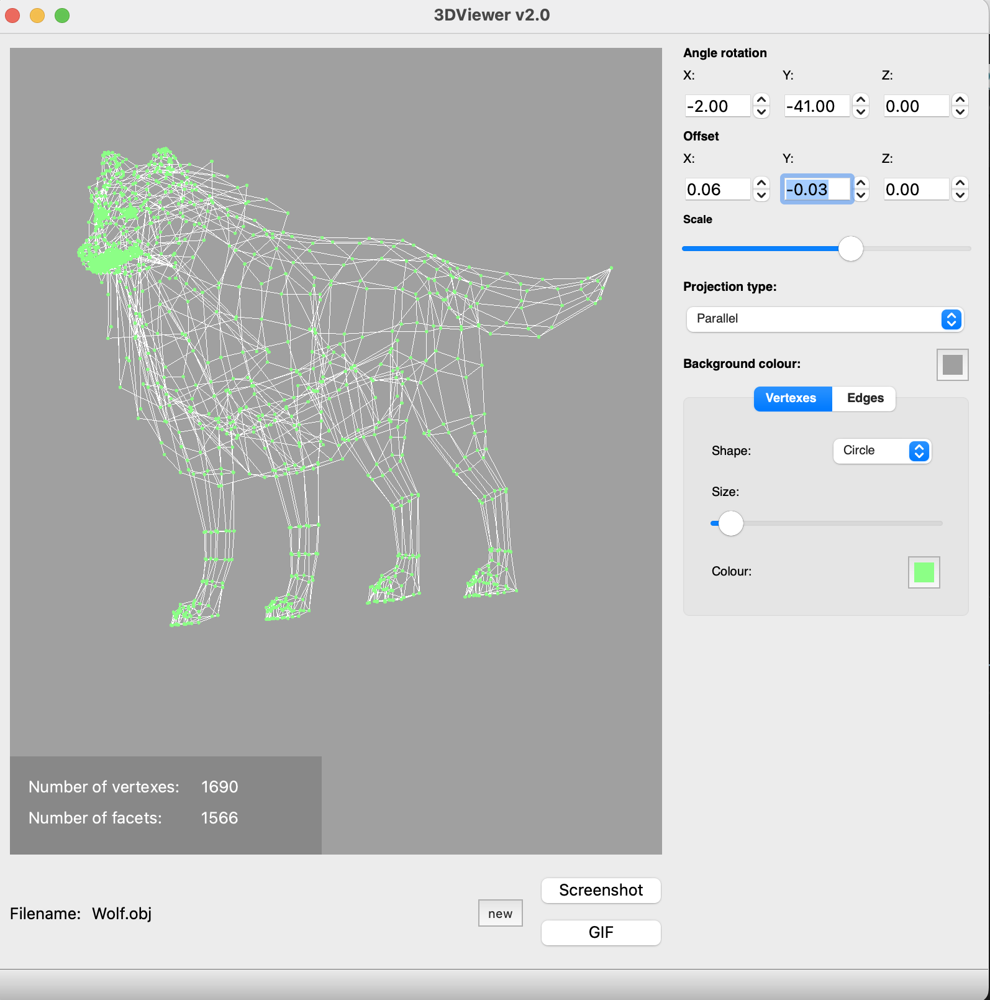

# 3DViewer_v2.0

##  Программа для просмотра 3D моделей

3DViewer_v2.0 Это программа для открытия 3D моделей в формате .obj файлов. Функционал программы позволяет манипулировать положением модели в пространстве через опреации по **перемещению и вращению по осям Х У Z, приближению и отдалению**. В приложении предусмотрены **пользовательские настройки отображения** (цвет фона, цвет и форма линий, цвет и форма точек). Предусмотрена возможность делать **скриншот** и запись последних **5ти** секунд окна отображения модели в формате **.gif** . 

